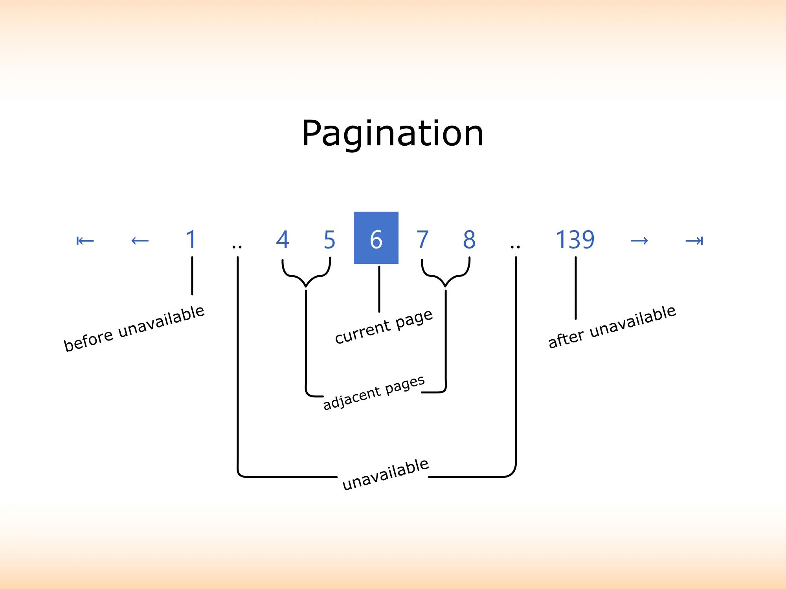

# Rundiz Pagination.JS

JavaScript Pagination.<br>
The highly customizable JS pagination class. 

[](https://www.npmjs.com/package/rd-pagination.js) 
[](https://www.npmjs.com/package/rd-pagination.js) 
[](https://www.npmjs.com/package/rd-pagination.js)


Example:  
All HTML you need.
```html
<nav class="rd-pagination" aria-label="Page navigation example"></nav>
<script src="assets/js/rd-pagination.js"></script>
```
All JavaScript you need.
```js
const rdPagination = new RdPagination('.rd-pagination', {
    base_url: '?start=%PAGENUMBER%',
    page_number_value: 0,
    total_records: 195,
});
rdPagination.createLinks();
```
That's all. See more samples in folder **tests/samples**.

### Samples
* [Sample 1](https://rundiz.github.io/rd-pagination.js/tests/samples/sample01.html) use offset query string.
* [Sample 2](https://rundiz.github.io/rd-pagination.js/tests/samples/sample02.html) use page number query string.
* [Sample 3](https://rundiz.github.io/rd-pagination.js/tests/samples/sample03.html) use different selector.
* [Sample 4](https://rundiz.github.io/rd-pagination.js/tests/samples/sample04.html) full options.
* [Sample 5](https://rundiz.github.io/rd-pagination.js/tests/samples/sample05.html) use pre-set style class.
* [Sample 6](https://rundiz.github.io/rd-pagination.js/tests/samples/sample06-ajax.html) use AJAX. (Please download and try it from your server.)
* [Sample 7](https://rundiz.github.io/rd-pagination.js/tests/samples/sample07.html) use multiple pagination.
* [Sample 8](https://rundiz.github.io/rd-pagination.js/tests/samples/sample08.html) use custom design.

## Pagination parts description
This repository ported from [Rundiz Pagination](https://github.com/Rundiz/pagination). So, the options mostly the same.


* "before unavailable" items number can be set via `unavailable_before` option. Example: `{unavailable_before: 1}`
* "unavailable" text can be set via `unavailable_text` option. Example: `{unavailable_text: '..'}`
* "adjacent pages" can be set the number via `number_adjacent_pages` option. Example: `{number_adjacent_pages: = 3}`
* "after unavailable" items number can be set via `unavailable_after` option. Example: `{unavailable_after: 2}`
* Read more in JS class constructor on `options` argument.

### Options
| Param | Type | Description |
| --- | --- | --- |
| options.base_url | <code>string</code> | The URL for use when generate page numbers with links (Required).<br>              Set the position where page numbers will be appears as URI segment or query string with `%PAGENUMBER%` placeholder.<br>              Example 1: `http://domain.tld/my-category/page/%PAGENUMBER%` This URL use page number as URI segment.<br>              Example 2: `http://domain.tld/my-category?page=%PAGENUMBER%` This URL use page number as query string.<br>              Example 3: `http://domain.tld/my-category?filter=some_filter_values&amp;search=foobar&amp;page=%PAGENUMBER%` This URL use page number as query string with other query strings in it, seperate each query string with `&amp;` not just `&`.<br>              Example 4: `http://domain.tld/my-category?start=%PAGENUMBER%` This URL use page number as query string but use start as the name.<br>              You have to get the page number value and set its value to this class in the option "page_number_value". |
| options.page_number_value | <code>number</code> | The current page number value (Required). This class cannot detect current page number automatically because of dynamic styles of URL. So, you have to manually set its value to this option. |
| options.total_records | <code>number</code> | The total number of records (Required). This means "all" records (maybe with sql `WHERE` conditions but..) with out the "LIMIT" or slices commands. |
| options.items_per_page | <code>number</code> | The number of items that will be displaying per page. Such as number of articles to display in each page. Default is 10. |
| options.page_number_type | <code>string</code> | The page number type. The value can be `start_num` or `page_num`.<br>                Start number or `start_num` also know as offset number. (eg. page number value will be 0, 10, 20, 30, ...)<br>              Page number or `page_num`. (eg. page number value will be 1, 2, 3, 4, ...)<br>              Default is `start_num`. |
| options.current_page_link | <code>boolean</code> | Display current link at current page. Set to `true` to display, `false` not to display. Default is `false`. |
| options.current_page_link_attributes | <code>object</code> | The current page link attributes in object where key is attribute name.               Example `{'class' => 'my class'}`. Must not contains `href`, `data-rd-pagination` attributes. |
| options.current_tag_close | <code>string</code> | The current page close tag. If you set to display current page, this will be placed after link to the current page. Default is empty. |
| options.current_tag_open | <code>string</code> | The current page open tag. If you set to display current page, this will be placed before link to the current page. Default is empty. |
| options.first_page_always_show | <code>boolean</code> | If you are at first page the first page link will not show if you set this value to `false`, if you set to `true` it will be always show the first page link. Default is `false`. |
| options.first_page_link_attributes | <code>object</code> | The first page link attributes in object where key is attribute name.               Example `{'class' => 'my class'}`. Must not contains `href`, `data-rd-pagination` attributes. |
| options.first_page_text | <code>string</code> \| <code>false</code> | The link text of the paginate that will go to the first page. Set to `false` to not displaying first page link at all. |
| options.first_tag_close | <code>string</code> | The first page close tag. If you set to display first page, this will be placed after link to the first page. Default is 1 space. |
| options.first_tag_open | <code>string</code> | The first page open tag. If you set to display first page, this will be placed before link to the first page. Default is 1 space. |
| options.last_page_always_show | <code>boolean</code> | If you are at last page the last page link will not show if you set this value to `false`, if you set to `true` it will be always show the last page link. Default is `false`. |
| options.last_page_link_attributes | <code>object</code> | The last page link attributes in object where key is attribute name.               Example `{'class' => 'my class'}`. Must not contains `href`, `data-rd-pagination` attributes. |
| options.last_page_text | <code>string</code> \| <code>false</code> | The link text of the paginate that will go to the last page. Set to `false` to not displaying last page link at all. |
| options.last_tag_close | <code>string</code> | The last page close tag. If you set to display last page, this will be placed after link to the last page. Defauls is 1 space. |
| options.last_tag_open | <code>string</code> | The last page open tag. If you set to display last page, this will be placed before link to the last page. Default is 1 space. |
| options.next_page_always_show | <code>boolean</code> | If you are at last page the next page link will not show if you set this value to `false`, if you set to `true` it will be always show the next page link. Default is `false`. |
| options.next_page_link_attributes | <code>object</code> | The next page link attributes in object where key is attribute name.               Example `{'class' => 'my class'}`. Must not contains `href`, `data-rd-pagination` attributes. |
| options.next_page_text | <code>string</code> \| <code>false</code> | The link text of the paginate that will go to the next page. Set to `false` to not displaying next page link at all. |
| options.next_tag_close | <code>string</code> | The next page close tag. If you set to display next page, this will be placed after link to the next page. Default is 1 space. |
| options.next_tag_open | <code>string</code> | The next page open tag. If you set to display next page, this will be placed before link to the next page. Default is 1 space. |
| options.number_adjacent_pages | <code>number</code> | The number of adjacent pages before and after the current page. Defaut is 5. |
| options.number_display | <code>boolean</code> | Display the page numbers or not. Set to `true` to display, `false` not to display. Default is `true`. |
| options.number_page_link_attributes | <code>object</code> | The number page link attributes in object where key is attribute name.               Example `{'class' => 'my class'}`. Must not contains `href`, `data-rd-pagination` attributes. |
| options.number_tag_close | <code>string</code> | The page number close tag. If you set to display page number, this will be placed after link to the page number. Default is 1 space. |
| options.number_tag_open | <code>string</code> | The page number open tag. If you set to display page number, this will be placed before link to the page number. Default is 1 space. |
| options.overall_tag_close | <code>string</code> | The overall close tag. It will be place at the very end of displaying page numbers. Default is empty. |
| options.overall_tag_open | <code>string</code> | The overall open tag. It will be place at the very beginning of displaying page numbers. Default is empty. |
| options.previous_page_always_show | <code>boolean</code> | If you are at first page the previous page link will not show if you set this value to `false`, if you set to `true` it will be always show the previous page link. Default is `false`. |
| options.previous_page_link_attributes | <code>object</code> | The previous page link attributes in object where key is attribute name.               Example `{'class' => 'my class'}`. Must not contains `href`, `data-rd-pagination` attributes. |
| options.previous_page_text | <code>string</code> \| <code>false</code> | The link text of the paginate that will go to the previous page. Set to `false` to not displaying previous page link at all. |
| options.previous_tag_close | <code>string</code> | The previous page close tag. If you set to display previous page, this will be placed after link to the previous page. Default is 1 space. |
| options.previous_tag_open | <code>string</code> | The previous page open tag. If you set to display previous page, this will be placed before link to the previous page. Default is 1 space. |
| options.unavailable_display | <code>boolean</code> | Display unavailable page (...) or not. Set to `true` to display, `false` to not display. Default is `false`. |
| options.unavailable_text | <code>string</code> | The unavailable page text. Basically it is something to show that there are pages between these range such as 3 dots text. (...) Default is `&hellip;`. |
| options.unavailable_tag_close | <code>string</code> | The unavailable page close tag. If you set to display unavailable page, this will be placed after unavailable page (...). Default is 1 space. |
| options.unavailable_tag_open | <code>string</code> | The unavailable page open tag. If you set to display unavailable page, this will be placed before unavailable page (...). Default is 1 space. |
| options.unavailable_after | <code>number</code> \| <code>false</code> | Number of pages to display after last unavailable page. Set number as integer or set to `false` to not display the pages after unavailable. Default is 2. |
| options.unavailable_before | <code>number</code> \| <code>false</code> | Number of pages to display before first unavailable page. Set number as integer or set to `false` to not display the pages before unavailable. Default is 2. |
| options.events | <code>object</code> | The events to be called. |
| options.events.onclick | <code>function</code> | On click event. This event is fired after displayed pagination. Set callback function here to call when user clicked. If you set callback function, this class will not use `preventDefault()` to let you handle it. |
